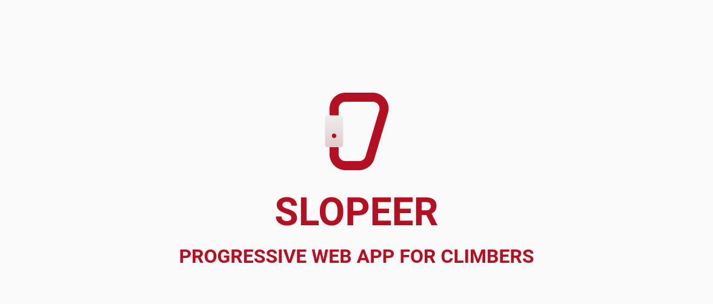
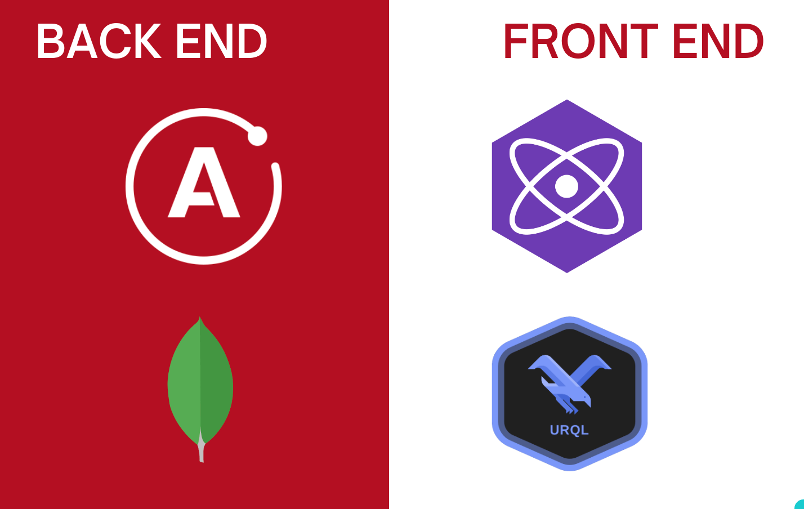

# Slopeer

Slopeer is a PWA for climbers that allows users to discover new climbing routes around them, see detailed information about
them and save that information for offline use when in the mountains ⛰.

In can be used from the browser, but also installed to any computer or mobile phone as it it was a native app.

<h1 style="color: #a4161b;">Register or Log in</h1>

  
  

<h1 style="color: #a4161b;">Add new routes</h1>

  
  
  

<h1 style="color: #a4161b;">Browse added routes. Even when offline</h1>

  
  

<h1 style="color: #a4161b;">See route details</h1>

  

<h1 style="color: #a4161b;">Discover new routes using the map</h1>

  
  

<h1 style="color: #a4161b;">Customize your profile or check out other users</h1>

  
  

# Tech Stack

## Main Technologies
### Back end

* Apollo Server - https://www.apollographql.com/docs/apollo-server/
* Mongo DB - https://www.mongodb.com/

### Front end

* Preact - https://preactjs.com/
* Urql - https://formidable.com/open-source/urql/docs/
## Other dependencies

* MapboxGL - https://docs.mapbox.com/mapbox-gl-js/api/
* JSON Web Tokens - https://jwt.io

# Getting Started

To run this app locally follow this instructions:

* Fork this repository and clone it to your machine
* Install the dependencies for the back end by runing `cd server && npm i` from the root folder.
* Install the dependencies for the front end by running `cd client && npm i` from the root folder.
* Start the server by running `node inex.js` in a terminal inside the server folder (Note: MongoDB should be installed and running for this to work properly).
* Run the client using `npm dev` in a terminal inside the client folder.

# This is great! Will this project go live ?
Most likely not. If you want something similar, head over to https://www.thecrag.com/en/home .
